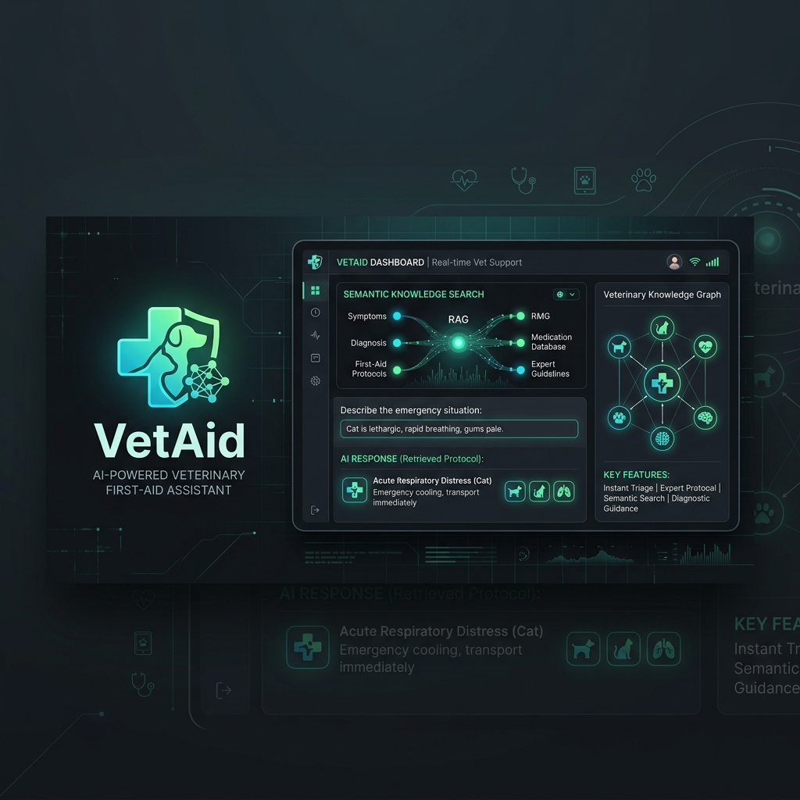
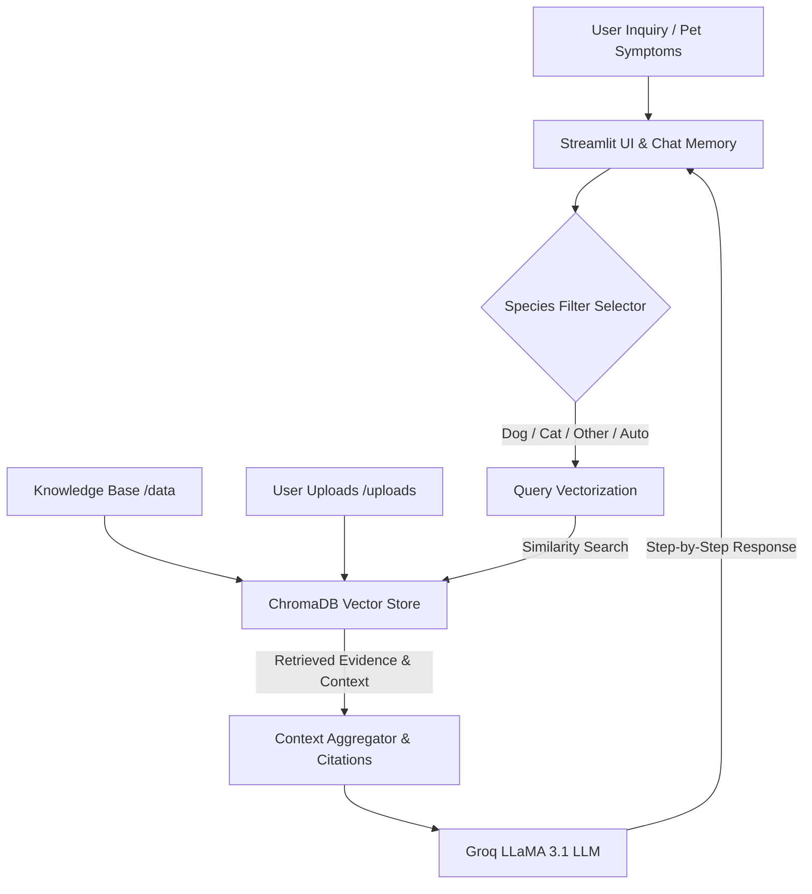

<p align="center">
  
</p>

<h1 align="center">🐾 VetAid | Veterinary First-Aid RAG Assistant</h1>

<p align="center">
  <strong>An AI-powered Retrieval-Augmented Generation (RAG) platform delivering calm, step-by-step first-aid guidance for critical pet emergencies.</strong>
</p>

<p align="center">
  <a href="https://python.org"></a>
  <a href="https://streamlit.io"></a>
  <a href="https://langchain.com"></a>
  <a href="https://groq.com"></a>
  <a href="https://trychroma.com"></a>
</p>

---

## 📖 Table of Contents
*   [🌟 Key Features](#-key-features)
*   [🛠️ System Architecture](#️-system-architecture)
*   [📂 Repository Structure](#-repository-structure)
*   [🚦 Getting Started](#-getting-started)
*   [📚 Knowledge Base](#-knowledge-base)
*   [⚠️ Emergency Disclaimer](#️-emergency-disclaimer)

---

## 🌟 Key Features

*   **⚡ Premium User Interface:** Sleek, modern Streamlit UI with adaptive light/dark mode styling, responsive typography, and clean information hierarchy.
*   **🧠 Conversational Memory:** Remembers details of the ongoing pet emergency so owners can ask natural follow-up questions.
*   **🔍 Grounded Answers with Citations:** Every guidance output provides inline citations and expandable source evidence directly from verified veterinary manuals.
*   **🐈 Species-Aware Retrieval:** Dedicated search filters tailored for `Auto`, `Dog`, `Cat`, or `Other` animals, ensuring targeted treatment (e.g., dog-specific bloat vs. cat-specific blockages).
*   **📂 Multi-Source Library:** Automatically indexes all `.txt` and `.pdf` files in the core data folder, and supports dynamic, user-uploaded emergency procedures or PDFs.
*   **💾 Auto-Save & Download:** Saves your active chat session locally, lets you restore recent histories, and export markdown transcripts of the case.

---

## 🛠️ System Architecture

VetAid uses semantic search retrieval to ground LLaMA 3.1 responses in vetted medical knowledge, preventing hallucinations during high-stakes situations:



---

## 📂 Repository Structure

```text
vet_rag_project/
├── app.py              # Main Streamlit UI dashboard and chat manager
├── rag_pipeline.py     # Custom RAG engine (ChromaDB + LangChain + Groq)
├── requirements.txt    # Package dependencies
├── README.md           # Visual setup and reference documentation
├── .env.example        # Environment variables configuration template
├── assets/             # Images and marketing graphics
│   └── vetaid_banner.png
├── data/               # Core veterinary knowledge base files
│   ├── vet_data.txt
│   ├── critical_emergencies.txt
│   ├── common_urgent_symptoms.txt
│   └── official_vet_emergency_reference.txt
├── chroma_db/          # Persistent local vector store index (gitignored)
├── chat_sessions/      # Local saved conversations (gitignored)
└── uploads/            # Temporary file upload stash (gitignored)
```

---

## 🚦 Getting Started

### 1. Prerequisites & Installation

Clone the repository and navigate into the project directory:

```bash
git clone https://github.com/Tayab-Ahamed/vetaid-rag-assistant.git
cd vetaid-rag-assistant
```

Create a Python virtual environment and activate it:

```bash
# Windows
python -m venv .venv
.venv\Scripts\activate

# macOS / Linux
python3 -m venv .venv
source .venv/bin/activate
```

Install the required packages:

```bash
pip install -r requirements.txt
```

### 2. Configure Environment Variables

Copy the environment template and name it `.env`:

```bash
cp .env.example .env
```

Open `.env` and fill in your free Groq API key:

```env
GROQ_API_KEY=your_actual_groq_api_key_here
```
> 💡 *Get your API key at [Groq Developer Console](https://console.groq.com).*

### 3. Run the Web Application

Launch the Streamlit dashboard:

```bash
streamlit run app.py
```
On the first run, VetAid will index your local veterinary textbooks in `data/` and build the vector database. Subsequent runs will use the cached local DB instantly.

---

## 📚 Knowledge Base

VetAid's default RAG index is generated from curated veterinary emergency sources:
*   `vet_data.txt` — Core veterinary emergency symptoms and first-aid logic.
*   `critical_emergencies.txt` — Focused guidance for immediate action (Bloat/GDV, anaphylaxis, urinary blockages, safe trauma transport).
*   `common_urgent_symptoms.txt` — Red flags for breathing distress, toxic bites, seizure escalations, and eye trauma.
*   `official_vet_emergency_reference.txt` — Supplements curated from standard manuals (e.g., Merck Veterinary Manual, ASPCA Animal Poison Control, Red Cross Animal First Aid).

---

## ⚠️ Emergency Disclaimer

> [!WARNING]
> **VetAid is for emergency first-aid instruction and educational reference only. It is NOT a replacement for direct, professional veterinary care.**
>
> If a pet is collapsing, bleeding profusely, choking, experiencing repeated seizures, or unable to urinate, **transport them to an emergency veterinarian immediately.** Always consult a certified vet for medical diagnosis and treatment.
